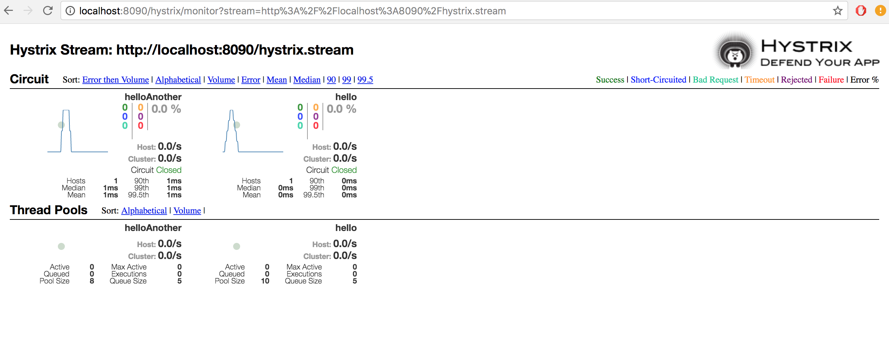
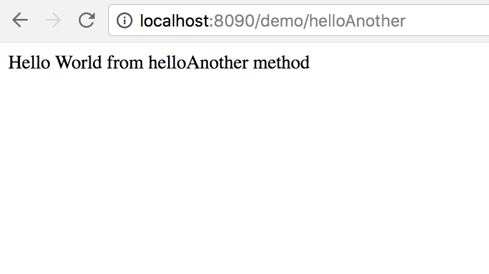
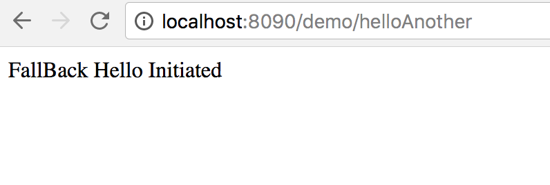
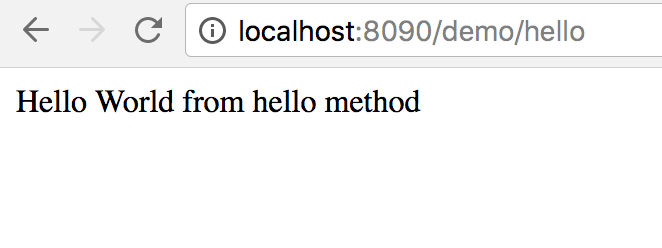
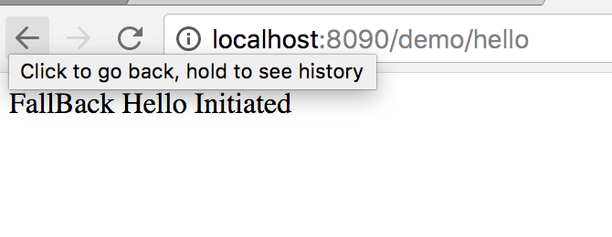

# springboot-hystrix-dashboard-demo

This project explains how hystrix works with simple example

## Hystrix Implementation ##

### Rest Method -1 ###

* created rest method /hello and implemented some logic.

```
public String hello(){
        if(RandomUtils.nextBoolean()){
            throw new RuntimeException("Failed!");
        }
        return "Hello World from hello method";
    }
```

* Add this annotation at the top of the rest method. The reason is, if the rest method failed or waits due to some reasons, 
hystrix will automatically call the fallback method.

```
@HystrixCommand(fallbackMethod = "fallbackHello", commandKey = "hello", groupKey = "hello")
```

* created fallback method like this
```
 public String fallbackHello(){
        return "FallBack Hello Initiated";
    }
```

* Need to annotate **@EnableCircuitBreaker** in the springboot main class.

## Hystrix Dashboard ##

* We can monitor the rest url which has hystrix implementation with the help of hystrx dashboard.

* To enable hystrix dashboard we need to add dependencies in pom.xml

```
        <dependency>
			<groupId>org.springframework.cloud</groupId>
			<artifactId>spring-cloud-starter-hystrix-dashboard</artifactId>
		</dependency>
```

* Need to annotate **@EnableHystrixDashboard** in the springboot main class.

### Hystrix Dashboard URL ###

http://hostname:port/hystrix


* We can see moinitor the rest methods here (See below screenshot)




### Output ###










### Happy Coding ###