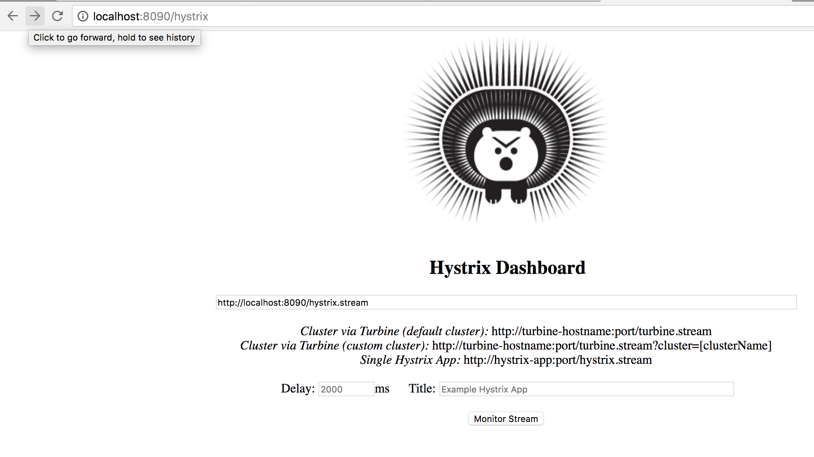

# springboot-hystrix-dashboard-demo

This project explains how hystrix works with simple example

## What is Hystrix ##

Enter what Netflix has created: Hystrix. Hystrix is a Java library aimed towards making integration points less susceptible to failures and mitigating the impact a failure might have on your application. It provides the means to incorporate bulkheads, circuit breakers and metrics into your framework. Those not familiar with these concepts should read the book I mentioned earlier. For example, a circuit breaker makes sure that if a certain integration point is having trouble, your application will not be affected. If for example a integration point takes 20 seconds to reply instead of the normal 50ms, you can configure a circuit breaker that trips if 10 calls within 10 seconds take longer than 5 seconds. When tripped, you can configure a quick fallback or fail fast.

Hystrix has an elegant solution for this. Every command to an external integration point should get wrapped in a HystrixCommand. HystrixCommand provide support for circuit breakers, timeouts, fallbacks and other disaster recovery methods. So instead of directly calling the integration point, you’ll call a command that in turn calls the integration point. Hystrix also allows you to choose whether you want to do this synchronously or asynchronously (returning a Future).

## Hystrix Implementation ##

### Rest Method -1 ###

* created rest method /hello and implemented some logic.

```
public String hello(){
        if(RandomUtils.nextBoolean()){
            throw new RuntimeException("Failed!");
        }
        return "Hello World from hello method";
    }
```

* Add this annotation at the top of the rest method. The reason is, if the rest method failed or waits due to some reasons, 
hystrix will automatically call the fallback method.

```
@HystrixCommand(fallbackMethod = "fallbackHello", commandKey = "hello", groupKey = "hello")
```

* created fallback method like this
```
 public String fallbackHello(){
        return "FallBack Hello Initiated";
    }
```

* Need to annotate **@EnableCircuitBreaker** in the springboot main class.

## Hystrix Dashboard ##

* We can monitor the rest url which has hystrix implementation with the help of hystrx dashboard.

* To enable hystrix dashboard we need to add dependencies in pom.xml

```
        <dependency>
			<groupId>org.springframework.cloud</groupId>
			<artifactId>spring-cloud-starter-hystrix-dashboard</artifactId>
		</dependency>
```

* Need to annotate **@EnableHystrixDashboard** in the springboot main class.

### Hystrix Dashboard URL ###

http://hostname:port/hystrix



* We can see moinitor the rest methods here (See below screenshot)


### Output ###


### Happy Coding ###
